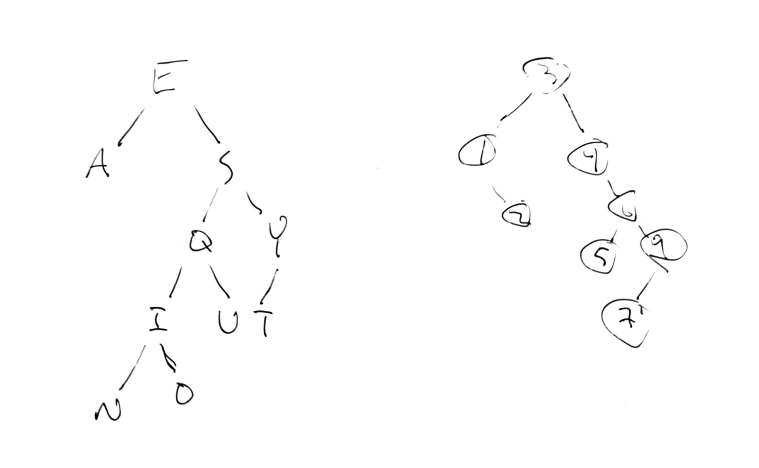
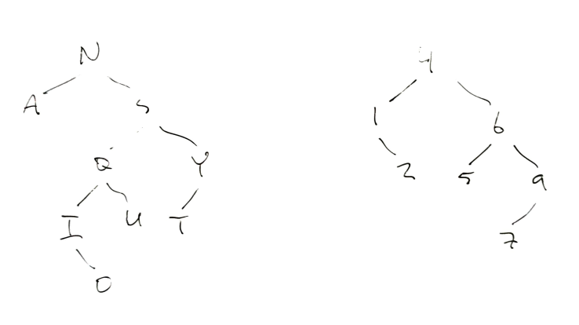

# Binary Search Trees

## 1. Draw a BST
- Given the data 3,1,4,6,9,2,5,7, if you were to insert this into an empty binary search tree, what would the tree look like? (Draw the tree, no coding needed here.)
- Draw the BST with the keys - E A S Y Q U E S T I O N



## 2. Remove the root

Show how the above trees would look like if you deleted the root of each tree. (Draw the trees, no coding needed here.)



## 3. Create a BST class
Walk through the binary search tree code in the curriculum and understand it well. Then write a BinarySearchTree class with its core functions (insert(), remove(), find()) from scratch.

- Create a binary search tree called BST and insert 3,1,4,6,9,2,5,7 into your tree. Compare your result with the result from the 1st exercise.
- Create a binary search tree called BST and insert E A S Y Q U E S T I O N into your tree. Compare your result with the result from the 1st exercise.

```js
class BinarySearchTree {
  constructor(key=null, value=null, parent=null) {
    this.key = key;
    this.value = value;
    this.parent = parent;
    this.left = null;
    this.right = null;
  }

// Because each row in a balanced tree contains 2 times as many nodes as the row before, the width grows exponentially with the number of nodes. This means that conversely, the height must grow logarithmically with the number of nodes. So the average insert case is O(log(n))

  insert(key, value) {
    // console.log('insert is looking at key ' + this.key + '!')
    if (this.key === null) {
      this.key = key;
      this.value = value;
    }

    if (key < this.key) {
      if (this.left === null) {
        this.left = new BinarySearchTree(key, value, this);
      } else {
        return this.left.insert(key, value);
      }
    }

    else if (key > this.key) {
      if (this.right === null) {
        this.right = new BinarySearchTree(key, value, this);
      } else {
        return this.right.insert(key, value);
      }
    }
  }

  find(key) {
    console.log('find is looking at key ' + this.key + '!')
    if (this.key === key) {
      return this.value;
    }

    else if (key < this.key && this.left) {
      return this.left.find(key);
    }

    else if (key > this.key && this.right) {
      return this.right.find(key);
    }

    else {
      throw Error('Key error')
    }
  }

  remove(key, parent=null) {
    // console.log('remove is looking at key ' + this.key + '!')
    if (this.key === key) {

      // In case remove is called on the key of the root node
      if(parent === null) {
        throw Error('You cannot delete the root node of the tree')
      }

      if (this.key < parent.key) {

        // Node has no children
        if (!this.left && !this.right) {
          this._replaceWith(null);
        }

        // Node has one child
        else if (this.left && !this.right) {
          this._replaceWith(this.left);
        }
        else if (!this.left && this.right) {
          this._replaceWith(this.right);
        }

        // Node has two children
        else if (this.left && this.right) {
          // Find the minimum value in the right subtree
            // Make that node the new parent node
            // Remove that node, as it is now a duplicate

          const newParentNode = this.right._findMin();
          this.key = newParentNode.key;
          this.value = newParentNode.value;
          newParentNode.remove(newParentNode.key);
        }
      }
    }

    else if (key < this.key && this.left) {
      return this.left.remove(key, this);
    }

    else if (key > this.key && this.right) {
      return this.right.remove(key, this);
    }

    else {
      throw Error('Key error')
    }
  }

  _replaceWith(node){
    if (this.parent) {
      if (this == this.parent.left) {
        this.parent.left = node;
      }
      else if (this == this.parent.right) {
        this.parent.right = node;
      }

      if (node) {
        node.parent = this.parent;
      }
    }
    else {
      if (node) {
        this.key = node.key;
        this.value = node.value;
        this.left = node.left;
        this.right = node.right;
      }
      else {
        this.key = null;
        this.value = null;
        this.left = null;
        this.right = null;
      }
    }
  }

  _findMin() {
    if (!this.left) {
      return this;
    }
    return this.left._findMin();
  }

}

const BST = new BinarySearchTree;
BST.insert(3);
BST.insert(1);
BST.insert(4);
BST.insert(6);
BST.insert(9);
BST.insert(2);
BST.insert(5);
BST.insert(7);
console.log(BST)

const BST2 = new BinarySearchTree;
BST2.insert('E')
BST2.insert('A')
BST2.insert('S')
BST2.insert('Y')
BST2.insert('Q')
BST2.insert('U')
BST2.insert('E')
BST2.insert('S')
BST2.insert('T')
BST2.insert('I')
BST2.insert('O')
BST2.insert('N')
console.log(BST2)
```

## 4. What does this program do?
Without running this code in your code editor, explain what the following program does. Show with an example the result of executing this program. What is the runtime of this algorithm?

```js
function tree(t){
    if(!t){
        return 0;
    }
    return tree(t.left) + t.value + tree(t.right)
}
```

> This function prints a flattened tree
> Runtime: O(n) as the function is called for every node in the tree